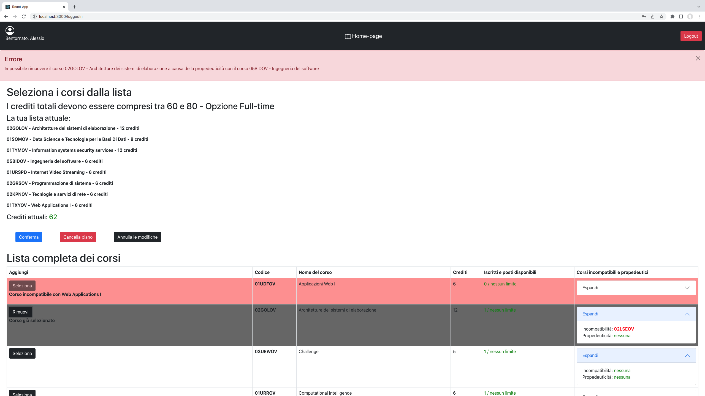

# Exam #1: Piano di studi
## Student: s294545 DE GREGORIO ALESSIO 

## React Client Application Routes

- Route `/`: Home-page visualizzabile a utenti non autenticati e utenti autenticati che non hanno ancora definito un piano di studi. Mostra la lista completa dei corsi e, per l'utente autenticato, un form per definire l'opzione del piano di studi;

- Route `/login`: Form per il login. Vengono richiesti email e password;

- Route `/loggedIn`: Home-page logged-in vistualizzabile ai soli utenti autenticati e con un piano di studi definito. Mostra la lista completa dei corsi (presente nella Home-page base) e il proprio piano di studi. La stessa route è usata per le funzioni di editing del piano. I corsi che l'utente vuole aggiungere/rimuovere dal proprio piano di studi sono selezionabili direttamente dalla tabella completa. Se un corso non può essere aggiunto al piano di studi, viene contrassegnato e viene riportata una motivazione.

## API Server

- GET `/api/courses` - Recupera la lista completa dei corsi
  - request body: _Nessuno_
  - response: `200 OK` (successo), `500 Internal Server Error` (errore generico)
  - response body: Array di oggetti contenente le informazioni sui corsi, comprendente il numero di studenti iscritti ad un dato corso

  ```
  [{
      "codice": "02KPNOV",
      "nome": "Tecnologie e servizi di rete",
      "crediti": 6,
      "studenti": 3,
      "maxStudenti": 3,
      "incompatibilita": "01OTWOV",
      "propedeuticita": null
  }, 
  ...
  ]
  ```

- GET `/api/listPlan` - Recupera il piano di studi dello studente
  - request body: _Nessuno_
  - response: `200 OK` (successo) `500 Internal Server Error` (errore generico)
  - response body: Array di oggetti contenente le informazioni sui corsi inserite nel piano studi dell'utente, comprendente il numero di studenti iscritti ad un dato corso. Ha la stessa struttura dell'array di sopra

- GET `/api/incomp/:incomp` - Recupera le informazioni riguardo incompatibilità di corsi, i cui codici sono specificati da `<incomp>`
  - request params: Array di oggetti contenente l'elenco dei codici dei corsi che presentano incompatibilità.
  - response: `200 OK` (successo), `404 Not Found` (corso non trovato), `500 Internal Server Error` (errore generico)
  - response body: Array di oggetti contenente l'elenco dei corsi incompatibili con quelli presenti in lista, contenente per ciasun corso il codice, il nome, e il nome del corso con cui è incompatibile

  ```
  [{
      "nome": "Computer architectures",
      "courseId": "02LSEOV",
      "nomeInc": "Architetture dei sistemi di elaborazione"
  }, 
  ...
  ]
  ```

- GET `/api/credits` - Recupera il totale dei crediti nel piano di studi dello studente
  - request body: _Nessuno_
  - response: `200 OK` (successo), `500 Internal Server Error` (errore generico)
  - response body: numero di crediti nel piano di studi dello studente

- POST `/api/addCourses` - Inserisce i corsi selezionati nel piano di studi dello studente. Se non è stato già creato, setta l'opzione di piano scelta (full-time o part-time)
  - request body: courses (lista corsi selezionati dallo studente per l'inserimento nel piano), tempOption (per indicare se lo studente ha già definito un'opzione o eventualmente deve definirla). La lista 'coruses' è un array di oggetti come riportato sopra
  - response: `201 Created` (successo), `503 Service Unavailable` (errore generico), `422 Unprocessable Entity` (errore di validazione)
  - response body: _Nessuno_

- DELETE `/api/deletePlan` - Elimina l'opzione del piano (full-time o part-time) e l'intero piano di studi dello studente
  - request body: _Nessuno_
  - response: `204 No Content` (successo), `503 Service Unavailable` (errore generico)
  - response body: _Nessuno_

- POST `/api/sessions` - Esegue il login dell'utente
  - request body: Un oggetto contenente email e password dell'utente
  - response: `200 OK` (successo) o `401 Not Found` (utente non nel db)
  - response body: Oggetto contenente le informazioni dell'utente
  ```
  {
      "idStudente": 101,
      "email": "alessio@polito.it",
      "nome": "Alessio",
      "cognome": "De Gregorio",
      "fullTime": 1
  }
  ```  

- DELETE `/api/sessions/current` - Esegue il logout dell'utente
  - request body: _Nessuno_
  - response: _Nessuna_
  - response body: _Nessuno_

- GET `/api/sessions` - Controlla se un utente è gia loggato
  - request body: _Nessuno_
  - response: `200 OK` (successo), `401 Unauthenticated user` (utente non autenticato)
  - response body: Oggetto contenente le informazioni dell'utente, come sopra

## Database Tables

- Table `studenti` - **idStudente** (chiave primaria), email, password, salt, nome, cognome, fullTime (valore booleano per definire l'opzione del piano)

- Table `corsi` - **codice** (chiave primaria), nome, crediti, maxStudenti, incompatibilita (eventuale stringa con codici dei corsi incompatibili), propedeuticita (eventuale codice di corso propedeutico)

- Table `piano` - **idStudente**, **codice** (coppia chiave primaria)

## Main React Components

- `Login` (in `/Login/Login.js`): Form per effettuare il login;
- `ErrorAlert` (in `/ErrorHandling/ErrorAlert.js`): Alert per mostrare i messaggi di errore verificati nell'applicazione, sia lato server che client;
- `EditOption` (in `/ListContent/EditOption.js`): Form per selezionare l'opzione di piano di studi (full-time o part-time). Alla conferma, mostra la Home-page logged-in;
- `CoursesTable` (in `/ListContent/CoursesTable.js`): Elenco di tutti i corsi disponibili (per utenti non loggati o con piano di studi non definito);
- `TableEditing` (in `/EditPlan/TableEditing.js`): Editing del piano di studi dello studente. Permette l'aggiunta/rimozione di corsi dal piano di studi direttamente dalla lista completa, oppure la cancellazione completa del piano stesso;
- `RenderTableEditing` (in `/EditPlan/RenderTableEditing.js`): Tabella con l'elenco di tutti i corsi selezionabili e inseribili direttamente nel piano di studi. All'aggiunta di un corso al piano, la lista viene aggiornata per mostrare le nuove incompatibilità/propedeuticità. Alla rimozione di un corso, oltre agli aggiornamenti già menzionati, segnala l'eventuale impossibilità a rimuovere il corso in caso di propeduticità con un altro già in elenco.

## Screenshot



## Users Credentials

- alessio@polito.it - password (full-time)
- mario@polito.it - password (part-time)
- luigi@polito.it - password (full-time)
- marco@polito.it - password (non definito)
- luca@polito.it - password (non definito)
